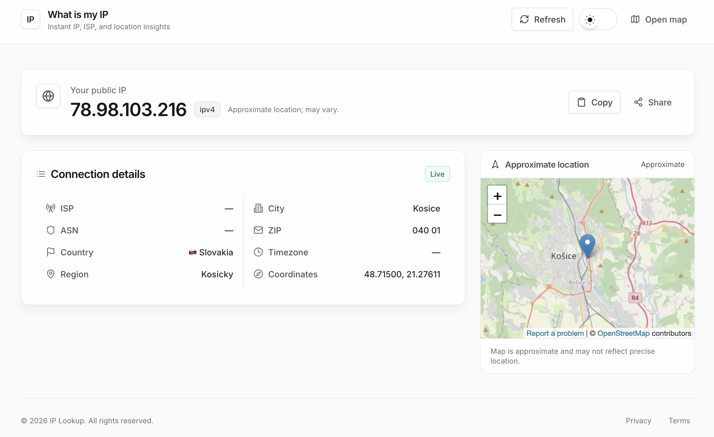

# What’s My IP – Full-Stack IP Lookup



A full-stack web app that surfaces your public IP, ISP, ASN, timezone, and approximate location via the [ipstack API](https://api.ipstack.com/). The backend proxies requests to protect your secret key; the frontend delivers a polished, themeable UI.

## Get Started

### 1. Clone the repository

```bash
git clone https://github.com/apilayer/whats-my-ip.git
```

### 2. Install dependencies

Install dependencies separately for backend and frontend.

**Backend**

```bash
cd whats-my-ip/backend
npm install
```

**Frontend**

```bash
cd whats-my-ip/frontend
npm install
```

### 3. Add your API key

1. Create a `.env` file inside `backend/`.
2. Add the following variables:
   ```
   IPSTACK_API_KEY=your_ipstack_key
   PORT=3001                # optional, defaults to 3001
   ```
3. Sign up for ipstack and ensure your plan includes **Connection** and **Time Zone** modules (available from the Starter plan).

### 4. Start the servers

**Backend** (Express proxy)

```bash
cd backend
npm run dev   # or npm start
```

**Frontend** (Vite + React)

```bash
cd frontend
npm run dev
```

The frontend expects the backend to be reachable at `/api`. When developing locally, set up a Vite proxy (already configured) or adjust `VITE_LOOKUP_PATH` at build time if you change the backend route.

## Features Implemented

### IP Lookup & Resilience

- Proxy-protected access to ipstack `/lookup` to keep the API key server-side.
- Sample endpoint (`/lookup/sample`) for offline/demo mode.
- Error handling surfaces upstream failures and preserves UX with safe defaults.

### Frontend Experience

- Light/dark theme toggle with system preference + persistence.
- Copy/share IP actions with feedback states.
- Connection detail cards for ISP, ASN, country, region, city, ZIP, timezone, and coordinates.
- OpenStreetMap embed with graceful fallbacks and loading overlays.
- Responsive layout, hover states, and polished cards.

### Backend Behaviors

- Health probe at `/health`.
- Timeout, upstream error propagation, and input normalization for lookup requests.

## Tech Stack

### Backend

- **Node.js** + **Express**
- **axios** for upstream requests
- **dotenv** for environment configuration

### Frontend

- **React 18** with Vite
- **Tailwind CSS 3** for styling
- **lucide-react** for icons

## API Endpoints (Backend)

```
GET /health
GET /lookup?ip={ip|check}&[ipstack_query_params]
GET /lookup/sample
```

- `/lookup` defaults to `ip=check`, letting ipstack detect the caller IP.
- Returns ipstack JSON or a 502-wrapped error when upstream fails.
- `/lookup/sample` serves a static fixture for frontend/demo use.

## Usage Flow

1. Frontend calls `/api${VITE_LOOKUP_PATH || '/lookup'}`.
2. Backend proxies to ipstack with your `IPSTACK_API_KEY`.
3. Response is normalized (IP, version, ISP, ASN, geo, timezone).
4. UI renders summary, detail rows, and map; users can copy/share IP and open the map.

## Key Components

### Frontend

- **App.jsx** – Fetches IP details, manages theme, renders summary card, detail grid, map panel, and actions.
- **main.jsx** – React/Vite bootstrap.
- **styles.css** – Tailwind layers and theme transitions.

### Backend

- **src/server.js** – Express server with `/lookup`, `/lookup/sample`, and `/health` routes, plus error handling and timeouts.

## Notes

- Run backend before frontend; frontend proxies `/api` to the backend by default.
- If you change the backend route, set `VITE_LOOKUP_PATH` (e.g., `npm run demo` uses `/lookup/sample`).
- ipstack plan must include **Connection** and **Time Zone** modules for the displayed fields.

## Future Enhancements

- Add automated tests (frontend hooks, backend endpoints).
- Add toast notifications for errors and copy/share feedback.
- Persist last successful payload for offline display.
- Optional HTTPS reverse proxy configuration examples.
